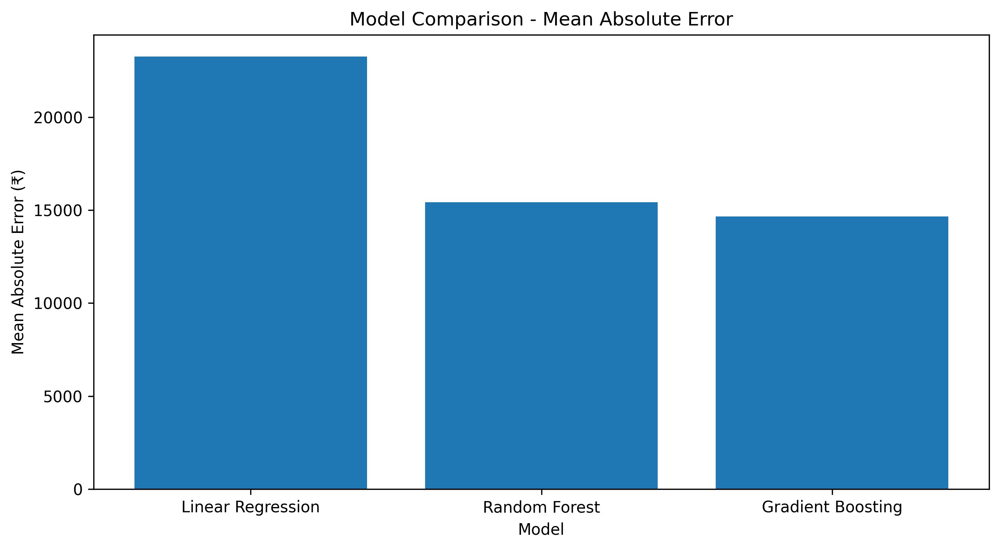
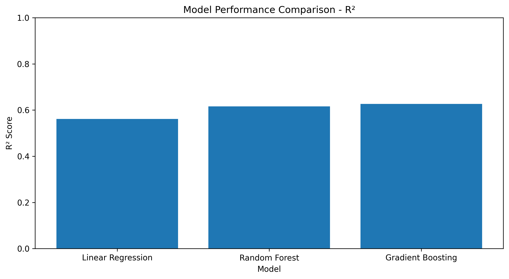
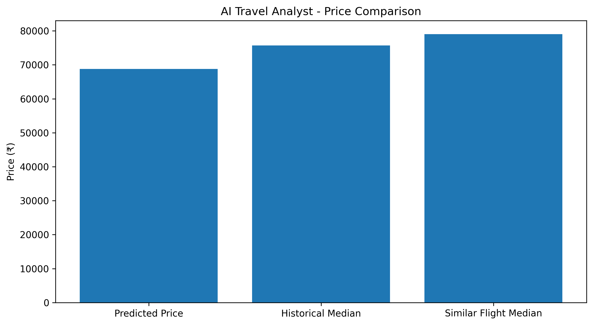

# ✈️ AI Travel Analyst

**An AI-powered flight price prediction & booking decision-support system** — not just a price predictor, but a full pipeline: **Predict → Explain → Compare → Simulate → Optimize.**

Built for the MIC AIML Department Recruitment Challenge (Data Science & Visualization track).

🔗 **[Live Demo](https://3036a270a226af12d5.gradio.live/)**
> ⚠️ This is a temporary Gradio share link and may expire — see [Running Locally](#️-running-locally) if it's down.

---

## 📸 Preview


---

## 🚀 What It Does

Most student flight-price projects stop at "predicted price = ₹61,643." This one goes further:

| Stage | What it does |
|---|---|
| **Predict** | Estimates a fare using a trained ML model (Gradient Boosting, selected after comparison against Linear Regression and Random Forest) |
| **Explain** | Shows a "Price Drivers" breakdown of which features (days before departure, class, stops, etc.) actually moved the prediction |
| **Compare** | Benchmarks the prediction against the historical median fare for that route/class, and reports a Deal Score + price percentile |
| **Simulate** | A What-If simulator lets you change stops, class, or booking window and see the price impact instantly |
| **Optimize** | The AI Booking Strategy Optimizer searches ~70+ combinations of stops × class × booking window and returns the cheapest realistic strategy |

---

## 🧠 Why Machine Learning (and not just a lookup table)

The model is benchmarked against a **historical-median baseline** on the same test set. The final model was chosen because it beat that baseline on both MAE and R² — the comparison lives in the notebook, not just asserted.

| Model | MAE (₹) | RMSE (₹) | R² |
|---|---|---|---|
| Linear Regression | 23,260.90 | 52,261.74 | 0.562 |
| Random Forest | 15,419.46 | 48,941.11 | 0.616 |
| **Gradient Boosting** ✅ | **14,659.32** | **48,221.48** | **0.627** |

Gradient Boosting was selected as the final model — it achieved the lowest MAE and highest R² of the three, meaning its average prediction error is roughly ₹760 lower than Random Forest and ~₹8,600 lower than Linear Regression, while explaining more of the variance in price.

*(Generated by `phase1_model_evaluation.py` → `ai_travel_model_comparison.csv`.)*

### Model comparison charts
| MAE (lower is better) | R² (higher is better) |
|---|---|
|  |  |

### What drives the price


### Prediction vs. market reference


---

## 🏗️ Architecture

```
                  ┌─────────────────────┐
User Input   ───▶ │   Gradio Dashboard   │
                  └──────────┬───────────┘
                             │
           ┌─────────────────┼─────────────────┐
           ▼                 ▼                 ▼
   ML Prediction      Decision Engine     What-If /
  (Gradient Boosting)  (Deal Score +      Optimizer
                         Recommendation)   (grid search)
           │                 │                 │
           └────────┬────────┴─────────┬───────┘
                     ▼                  ▼
              Historical Baseline   Feature Importance
               (median lookup)       (explainability)
```

---

## 🛠️ Tech Stack

- **Python**, **Pandas**, **NumPy** — data cleaning & preprocessing
- **scikit-learn** — model training, evaluation, and comparison (Linear Regression, Random Forest, Gradient Boosting)
- **Matplotlib** — evaluation and explainability charts
- **Gradio** — interactive dashboard (custom "flight instrument panel" dark theme)
- **FastAPI + joblib** — prediction API for cloud deployment
- *(Optional)* **Azure App Service** — persistent, always-on API hosting ([deployment guide](azure_deployment/DEPLOY_STEPS.md))

---

## 📂 Project Structure

```
.
├── AI_Travel_Analyst.ipynb          # data cleaning, EDA, and model training
├── phase1_model_evaluation.py       # model comparison, baseline benchmark, explainability
├── ai_travel_analyst_v2.py          # Gradio dashboard (prediction UI + simulator + optimizer)
├── ai_travel_analyst_model.pkl      # trained Gradient Boosting pipeline
├── ai_travel_model_comparison.csv   # model metrics (MAE / RMSE / R²)
├── final_prediction.csv             # sample prediction output
├── results/
│   ├── model_comparison_mae.png
│   ├── model_comparison_r2.png
│   ├── top_15_feature_importance.png
│   └── final_price_comparison.png
├── azure_deployment/
│   ├── api.py                       # FastAPI prediction endpoint
│   ├── requirements.txt
│   └── DEPLOY_STEPS.md              # Azure CLI deployment steps
├── PHASE3_user_validation.md        # user testing plan / template
├── requirements.txt
└── README.md
```

---

## ▶️ Running Locally

```bash
git clone https://github.com/anubhabpal1805/AI-Travel-Analyst.git
cd AI-Travel-Analyst
pip install -r requirements.txt

# 1. Train the model + generate evaluation files
#    (run as notebook cells, or as a script if converted)
jupyter notebook AI_Travel_Analyst.ipynb

# 2. Launch the dashboard
python ai_travel_analyst_v2.py
```

The app prints a local URL (and optionally a temporary public `gradio.live` link if `share=True`).

### Running the prediction API locally
```bash
cd azure_deployment
pip install -r requirements.txt
uvicorn api:app --reload
# then: curl http://127.0.0.1:8000/
```

---

## 🧪 User Validation

*(Template ready in [`PHASE3_user_validation.md`](PHASE3_user_validation.md) — real numbers to be filled in after a testing round with 10–20 users.)*

- **N testers:** —
- **Found the Deal Score understandable:** —%
- **Would use the tool for a real booking:** —%

---

## 🗺️ Roadmap

- [x] Multi-model comparison with justified model selection
- [x] Baseline-vs-ML benchmark
- [x] Feature-importance explainability
- [x] What-If simulator
- [x] AI Booking Strategy Optimizer
- [x] FastAPI prediction endpoint
- [ ] Real user validation study
- [ ] Permanent cloud deployment (Azure App Service)
- [ ] Hyperparameter tuning + cross-validation pass
- [ ] SHAP-based explainability (beyond built-in feature importances)

---

## 🚧 Challenges Faced

- Flight prices are highly right-skewed, which made a single global model less accurate for outlier fares — addressed by benchmarking against a route+class historical-median baseline rather than trusting raw R² alone.
- Balancing model interpretability against accuracy — Gradient Boosting was chosen over a more opaque option specifically because its feature importances could be explained to a non-technical user in the dashboard.

## 🔭 Future Improvements

- Hyperparameter tuning (GridSearchCV/Optuna) on the Gradient Boosting model
- Log-transforming the price target to further reduce skew-driven error
- SHAP values for per-prediction explainability instead of global feature importance only
- Persistent Azure deployment replacing the temporary Gradio share link

---

## 📄 License

This project is licensed under the [MIT License](LICENSE).

---

*Built as part of the MIC AIML Department Recruitment Challenge — an exploration into ML-driven travel decision support.*
